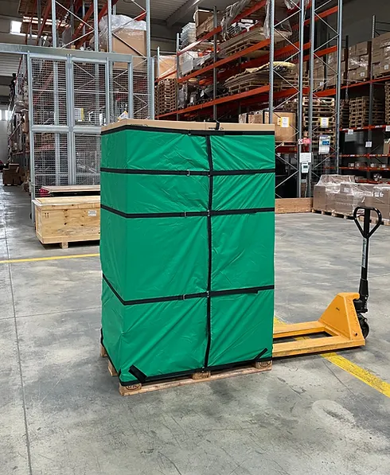

+++
## Front matter for English translation
#type = 'solutions'
+++

The sustainable alternative to plastic wrap for pallet packaging
================================================================

By the end of 2025, companies will need to have reduced the introduction of plastic packaging on the market by 20%, of which 50% will be through reuse.

Ecklo offers you a tangible solution to meet the government's set targets:

* Without compromising the safety of your merchandise.
* Without disrupting your logistical processes.

Eco-friendly
------------

The production of packaging follows a circular economy approach.

* Reusable over 150 times
* Recycled and recyclable
* Repairable

Convenient
----------

Ecklo's packaging was designed to meet the operational constraints of businesses.

* Adaptable 1m20 - 1m50 - 1m80
* Secures and protects merchandise
* Set up alone in less than 1'45"

Compared to plastic wrap
------------------------

* 88% reduction in CO2
* 95% reduction in waste

Carbon emissions and waste generated by Ecklo compared to plastic wrap over 150 uses.

Life Cycle Assessment conducted by the RIVERSE company
