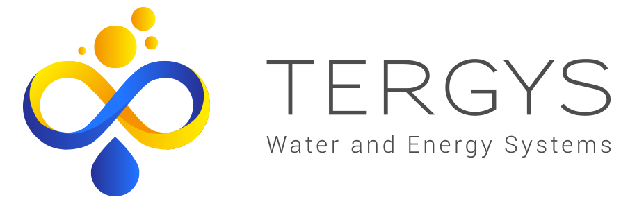

+++
## Front matter
+++

Un approvisionnement sécurisé en énergie verte et en eau
=============================================================

Des systèmes autonomes de production d’énergie et d’eau à des coûts optimisés. Une réponse adaptée à vos besoins et votre environnement.



Une approche innovante et pragmatique
-------------------------------------

Pour répondre à des besoins en eau potable, dessalée, recyclée.

* Un software pour définir la combinaison optimale
* Un système hybride de stockage énergétique
* Un pilotage intelligent pour optimiser les coûts
* Un concept modulaire, évolutif à maintenance réduite

La solution
-----------

L’offre combinée autonome de production d’énergie verte et d’eau.

* Energie verte: Production d’énergie à partir d’énergie renouvelable
* Pilotage développé par TERGYS: Pilotage intelligent Stockage/Usages
* Production d’eau: Eau potable , Eau recyclée, Eau de procédés, Eau dessalée
* Energie pour autres usages

Un écosystème de partenaires
----------------------------

TERGYS s’appuie sur un écosystème innovant pour proposer les meilleures solutions.

* St@rtec developpement ([Site web](https://startec-developpement.com/fr/))
* polymem ([Site web](https://www.polymem.fr/))

Découvrez notre expertise en traitement d'eau et énergie renouvelable. 
Des solutions autonomes et automatisées pour un avenir durable.
